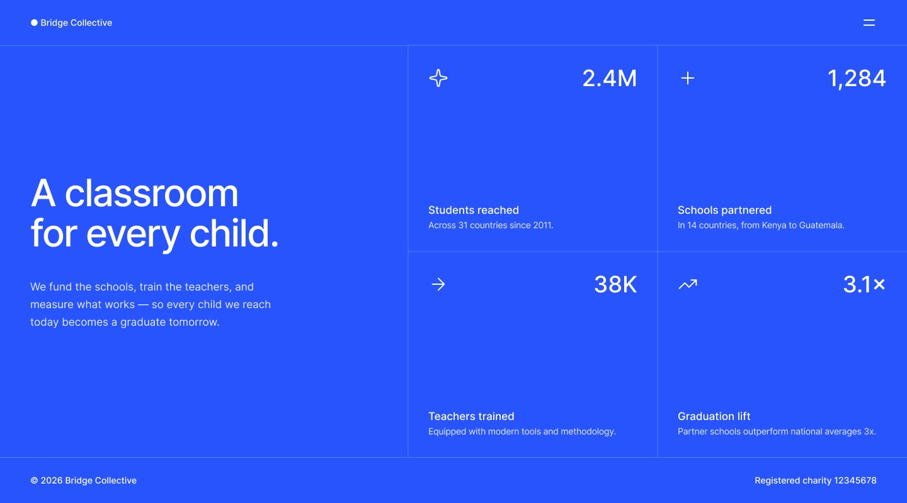
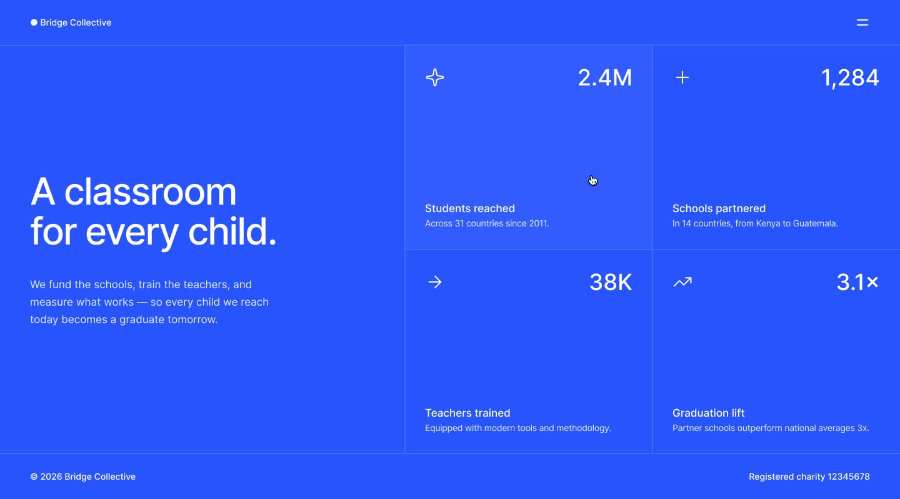
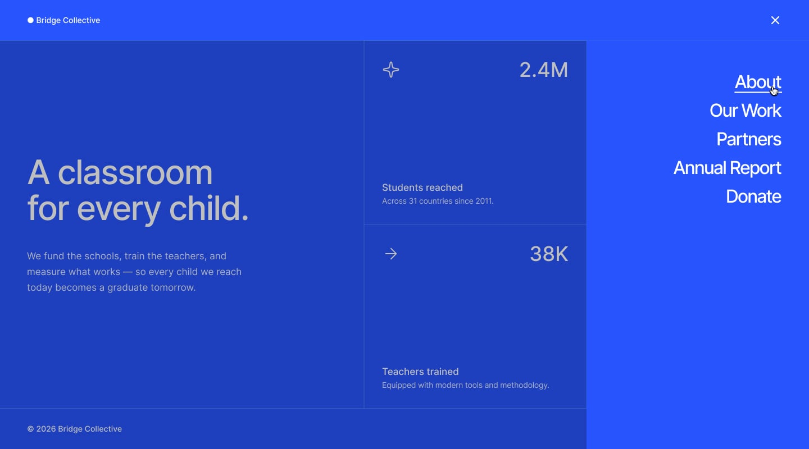
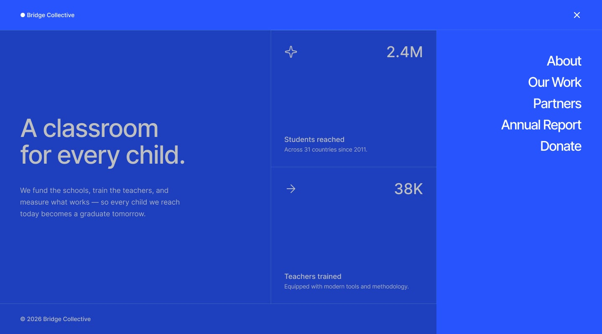
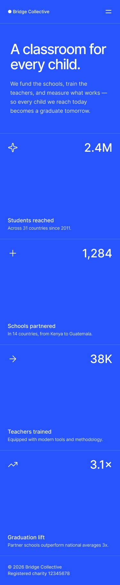
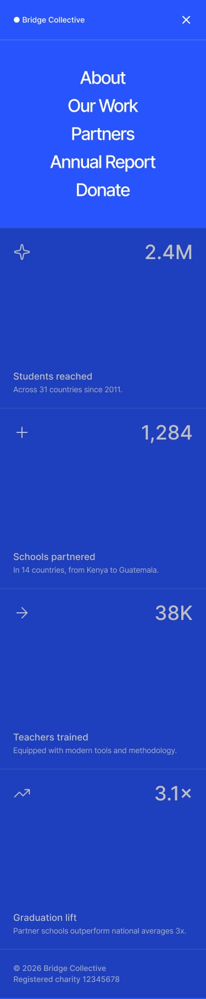

# Frontend Mentor - Grid landing page solution

This is a solution to the [Grid landing page challenge on Frontend Mentor](https://www.frontendmentor.io/challenges/grid-landing-page). Frontend Mentor challenges help you improve your coding skills by building realistic projects. 
## Table of contents

- [Overview](#overview)
  - [The challenge](#the-challenge)
  - [Screenshot](#screenshot)
  - [Links](#links)
- [My process](#my-process)
  - [Built with](#built-with)
- [Author](#author)

## Overview

### The challenge

Users should be able to:

- View the optimal layout for the page depending on their device's screen size
- See hover and focus states for all interactive elements on the page
- Open and close the navigation menu at any screen size (optional JavaScript)

### References Screenshots

### Links

- Solution URL: [https://www.frontendmentor.io/solutions/grid-landing-page-grid-flexbox-javascript-functions-responsive-ADj5XsgV0E]
- Live Site URL: [https://samuelabreu74.github.io/Grid-landing-page-main/]

## My process

### Built with

- Semantic HTML5 markup
- CSS custom properties & Media Queries
- CSS Grid
- Flexbox
- JavaScript Functions & Class Manipulation
- Mobile-first workflow

## Author

- Frontend Mentor - [@SamuelAbreu74](https://www.frontendmentor.io/profile/SamuelAbreu74)
- Instagram - [@samuelabreu.dev](https://www.instagram.com/samuelabreu.dev/)
- Github - [@SamuelAbreu74] (https://github.com/SamuelAbreu74)